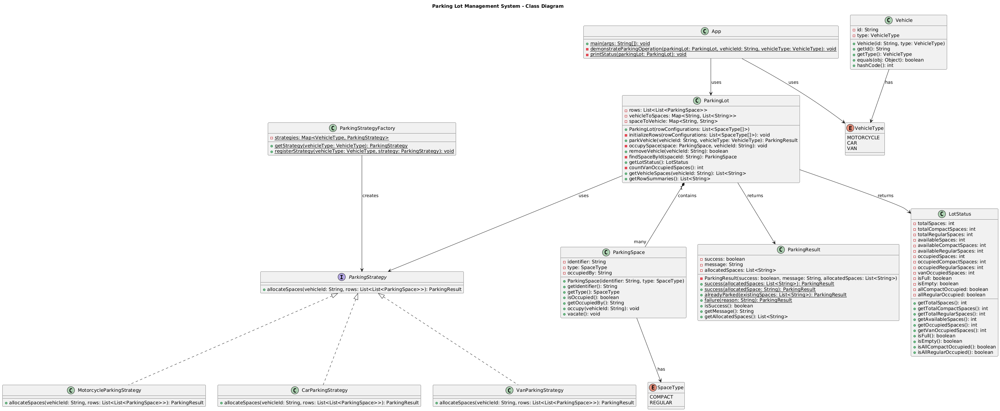
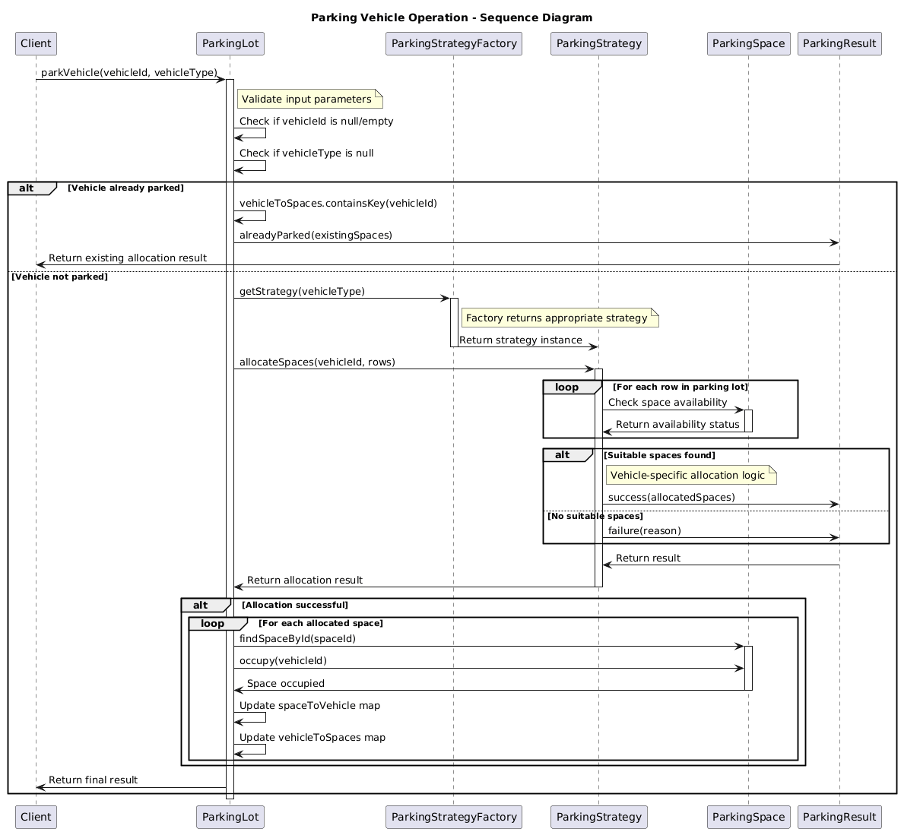
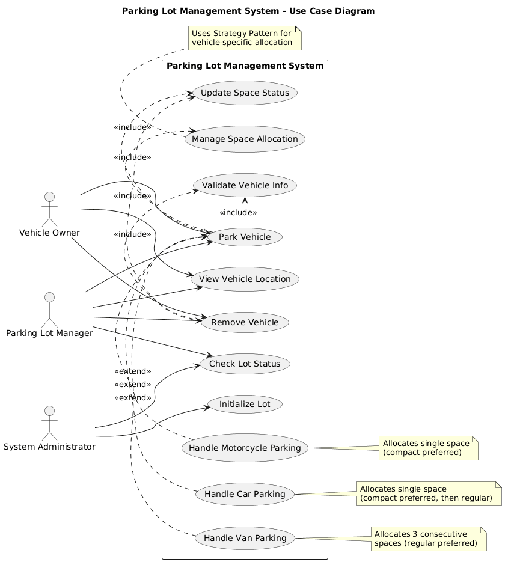
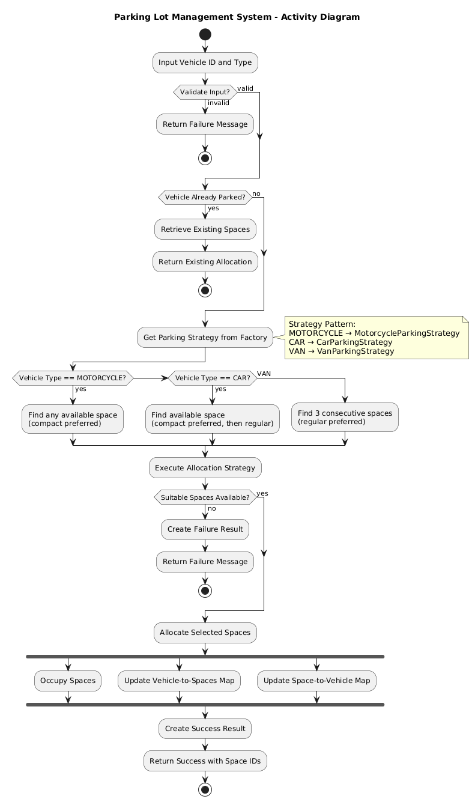
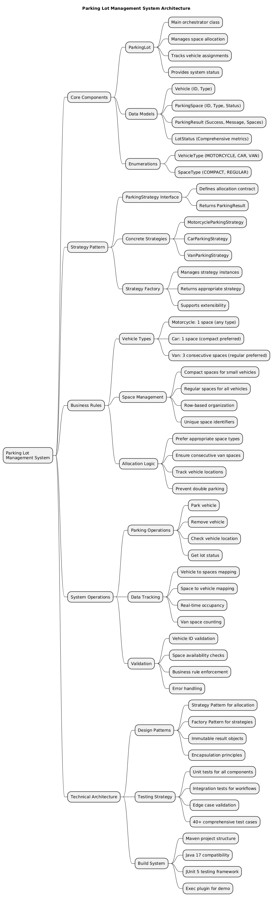

# Parking Lot Management System

A comprehensive object-oriented parking lot management system built with Java 17 and Maven. This system handles different vehicle types (motorcycles, cars, vans) with specific parking constraints, provides detailed status reporting, and supports both single-level and **multi-level parking structures with elevator management**.

## ✨ New Multi-Level Features

The system now supports **multi-level parking lots** with sophisticated elevator management:

- **🏢 Multi-Level Architecture**: Support for underground, ground, and elevated levels with different characteristics
- **🛗 Intelligent Elevator System**: Automated elevator request and optimization for cross-level vehicle movement
- **🎯 Level-Based Allocation**: Smart allocation considering level type preferences, vehicle restrictions, and occupancy
- **🚗 Vehicle Access Control**: Level-specific vehicle type restrictions (e.g., vans restricted to ground level)
- **📊 Enhanced Monitoring**: Comprehensive status reporting across all levels and elevator systems
- **⚙️ Maintenance Mode**: Elevator maintenance management with automatic request reassignment

### Quick Multi-Level Demo
```bash
# Run the multi-level parking demonstration
mvn exec:java -Dexec.mainClass="com.example.parkinglot.multilevel.MultiLevelParkingDemo"
```

## Table of Contents
- [Multi-Level Features](#new-multi-level-features)
- [Setup Instructions](#setup-instructions)
- [Architecture Overview](#architecture-overview)
- [Design and Architecture](#design-and-architecture)
- [Requirements Assumptions](#requirements-assumptions)
- [Limitations and Future Extensions](#limitations-and-future-extensions)
- [Features](#features)
- [Project Structure](#project-structure)
- [Usage Examples](#usage-examples)
- [Testing](#testing)

## Setup Instructions

### Prerequisites
- **Java 17 or higher**: Download from [Oracle JDK](https://www.oracle.com/java/technologies/downloads/) or [OpenJDK](https://openjdk.org/)
- **Maven 3.6 or higher**: Download from [Apache Maven](https://maven.apache.org/download.cgi)

### Installation Steps

1. **Clone or Download** the project:
   ```bash
   git clone <repository-url>
   cd parkinglotmgmt
   ```

2. **Verify Java Installation**:
   ```bash
   java --version
   # Should show Java 17 or higher
   ```

3. **Verify Maven Installation**:
   ```bash
   mvn --version
   # Should show Maven 3.6 or higher
   ```

4. **Compile the Project**:
   ```bash
   mvn clean compile
   ```

5. **Run Tests** (recommended to verify setup):
   ```bash
   mvn test
   ```

6. **Run the Demo Application**:
   ```bash
   mvn exec:java -Dexec.mainClass="com.example.parkinglot.App"
   ```

### IDE Setup (Optional)
- **IntelliJ IDEA**: Import as Maven project
- **Eclipse**: Import → Existing Maven Projects
- **VS Code**: Open folder with Java Extension Pack installed

## Design and Architecture

### Core Design Philosophy

The system is designed around **Object-Oriented Principles** and **Design Patterns** to ensure maintainability, extensibility, and testability.

### Key Design Patterns

#### 1. Strategy Pattern
**Purpose**: Handle different vehicle allocation strategies

**Implementation**:
- `ParkingStrategy` interface defines the allocation contract
- Concrete strategies (`MotorcycleParkingStrategy`, `CarParkingStrategy`, `VanParkingStrategy`) implement vehicle-specific logic
- `ParkingStrategyFactory` manages strategy selection

**Benefits**:
- Easy to add new vehicle types without modifying existing code
- Each allocation algorithm is isolated and testable
- Runtime flexibility for strategy selection

```java
// Example: Adding a new vehicle type
public class TruckParkingStrategy implements ParkingStrategy {
    @Override
    public ParkingResult allocateSpaces(String vehicleId, List<List<ParkingSpace>> rows) {
        // Truck-specific allocation logic
        return ParkingResult.success(allocatedSpaces);
    }
}
```

#### 2. Factory Pattern
**Purpose**: Create appropriate parking strategies

**Reasoning**: Centralizes strategy creation and makes it easy to manage which strategy handles which vehicle type.

#### 3. Immutable Result Objects
**Purpose**: Thread-safe and predictable result handling

**Implementation**: `ParkingResult` and `LotStatus` are immutable with static factory methods.

### Architecture
Currently, everything is under one layer. However, App.java functions could be moved in the presentation layer such as React application.

#### 1. Entry point to the application `App.java`)
- Demonstrates system capabilities
- Provides user interaction examples
- Handles output formatting


#### 2. Business Logic (`ParkingLot.java`)
- Core orchestration of parking operations
- Delegates allocation to appropriate strategies
- Manages vehicle-to-space mapping
- Enforces business rules

#### 3. Domain Model (`model` package)
- `ParkingSpace`: Represents individual parking spots
- `Vehicle`: Represents parked vehicles
- `ParkingResult`: Encapsulates operation results
- `LotStatus`: Provides comprehensive status reporting
- Enums: `VehicleType`, `SpaceType` for type safety

#### 4. Strategy Patterns(`strategy` package)
- Contains all allocation strategies
- Isolated business logic for each vehicle type
- Factory for strategy management

### Data Structure Choices

#### Two-Way Mapping System
```java
private final Map<String, List<String>> vehicleToSpaces; // Vehicle → Spaces
private final Map<String, String> spaceToVehicle;        // Space → Vehicle
```

**Reasoning**: 
- O(1) lookup for both "find vehicle's spaces" and "find space's vehicle"
- Simplifies removal operations
- Maintains data consistency

#### Row-Based Space Organization
```java
private final List<List<ParkingSpace>> rows;
```

**Reasoning**:
- Mirrors real-world parking lot structure
- Enables efficient van parking (consecutive spaces in same row)
- Supports row-based status reporting
- Allows for future row-specific optimizations

### Space Identification Scheme
Format: `"R{row}-{space}"` (e.g., "R1-1", "R2-3")

**Reasoning**:
- Human-readable and intuitive
- Encodes row information for debugging
- Unique across the entire parking lot
- 1-indexed to match human expectations

## Requirements Assumptions

### Explicit Requirements Interpretations

1. **Van Parking**: "Vans require two contiguous regular spaces"
   - **Assumption**: Both spaces must be in the same row and be regular
   - **Reasoning**: Real-world parking lots don't span vehicles across rows; vans don't fit compact spaces

2. **Car Parking**: "Cars can park in regular or compact spaces"
   - **Assumption**: Cars may use compact spaces when available
   - **Reasoning**: Improves utilization; many modern cars fit compact spots

3. **Motorcycle Parking**: "Motorcycles can park anywhere"
   - **Assumption**: Motorcycles prefer compact spaces when available
   - **Reasoning**: Efficient space utilization

### Implicit Assumptions Made

#### Input Validation
- **Vehicle IDs**: 
  - Can contain any characters
  - Are case-sensitive ("CAR001" ≠ "car001")
  - Leading/trailing whitespace is automatically trimmed
  - Empty or null IDs are rejected

#### System Behavior
- **Single-threaded**: No concurrent access protection implemented
- **Memory-based**: No persistence layer, all data in memory
- **Deterministic**: Same inputs always produce same results
- **Stateful**: Parking lot maintains state between operations

#### Business Rules
- **No reservation system**: First-come, first-served allocation
- **No time limits**: Vehicles can stay indefinitely
- **No fees**: Pure allocation system without billing
- **No special spaces**: No handicapped, VIP, or reserved spaces

#### Error Handling
- **Graceful degradation**: Invalid inputs return error messages, don't throw exceptions
- **Idempotent operations**: Parking the same vehicle twice returns existing allocation
- **Consistent state**: Failed operations don't modify system state

## Limitations and Future Extensions

### Current Limitations

#### Technical Limitations
1. **Concurrency**: No thread-safety mechanisms
   - **Impact**: Cannot handle multiple simultaneous requests
   - **Mitigation**: Add synchronized blocks or concurrent collections

2. **Persistence**: In-memory only
   - **Impact**: Data lost when application stops
   - **Mitigation**: Add database integration

3. **Scalability**: O(n) search operations
   - **Impact**: Performance degrades with large parking lots
   - **Mitigation**: Add spatial indexing or caching

#### Business Logic Limitations
1. **Fixed Vehicle Types**: Only supports 3 predefined types
   - **Impact**: Cannot handle special vehicles (buses, trucks, RVs)
   - **Mitigation**: Strategy pattern makes this extension straightforward

2. **Static Configuration**: Lot layout cannot be modified after creation
   - **Impact**: No support for lot expansion or reconfiguration
   - **Mitigation**: Add dynamic configuration management

3. **No Optimization**: Simple first-fit allocation
   - **Impact**: May lead to fragmentation
   - **Mitigation**: Implement smart allocation algorithms

### Immediate Extensions (Next Sprint)

#### High Priority
1. **Configurable Van Length**:
   - Make number of contiguous spaces for vans configurable (2 by default)
   - Extend `VanParkingStrategy` to respect configuration per lot/level

2. **Input Validation Enhancement**:
   - Add vehicle ID format validation
   - Implement maximum ID length restrictions

3. **Logging Integration**:
   - Add SLF4J logging for debugging
   - Track allocation decisions and failures

#### Medium Priority
1. **Configuration Externalization**:
   ```java
   // Load from properties file
   ParkingLot lot = ParkingLotBuilder.fromConfig("parking-config.json");
   ```

2. **Metrics and Monitoring**:
   - Average occupancy rates
   - Allocation success rates by vehicle type
   - Peak usage analytics

3. **API Layer**:
   ```java
   @RestController
   public class ParkingController {
       @PostMapping("/park")
       public ResponseEntity<ParkingResult> parkVehicle(@RequestBody ParkingRequest request) {
           // REST API implementation
       }
   }
   ```

### Long-term Extensions (Future Releases)

#### Advanced Features
1. **Multi-lot Management**:
   ```java
   public class ParkingComplex {
       private List<ParkingLot> lots;
       public ParkingResult parkVehicleOptimally(String vehicleId, VehicleType type);
   }
   ```

2. **Reservation System**:
   - Advance booking capabilities
   - Time-based slot management
   - Priority allocation for reservations

3. **Dynamic Pricing**:
   - Surge pricing during peak hours
   - Loyalty discounts
   - Integration with payment systems

4. **Smart Allocation**:
   - Machine learning for optimal space assignment
   - Predictive analytics for space availability
   - Real-time optimization based on usage patterns

#### Integration Capabilities
1. **IoT Integration**:
   - Sensor-based occupancy detection
   - Automated gate control
   - License plate recognition

2. **Mobile Application**:
   - Real-time space finder
   - Navigation to assigned spaces
   - Payment integration

3. **Third-party Integrations**:
   - Google Maps integration
   - Apple Pay/Google Pay support
   - Fleet management systems

### Alternative Design Approaches Considered

#### Event-Driven Architecture
```java
public interface ParkingEventListener {
    void onVehicleParked(VehicleParkedEvent event);
    void onVehicleRemoved(VehicleRemovedEvent event);
}
```
**Pros**: Better auditability, loose coupling
**Cons**: Added complexity for current requirements

#### Command Pattern
```java
public interface ParkingCommand {
    ParkingResult execute();
    void undo();
}
```
**Pros**: Undo/redo capabilities, request queuing
**Cons**: Over-engineering for current simple operations

#### Builder Pattern for Configuration
```java
ParkingLot lot = new ParkingLot.Builder()
    .addRow(REGULAR, REGULAR, COMPACT)
    .addRow(REGULAR, REGULAR, REGULAR)
    .withVanSpaces(3)
    .build();
```
**Pros**: More flexible configuration
**Cons**: Current array-based approach is simpler and sufficient

## Project Structure

```
parking-lot-management/
├── src/
│   ├── main/
│   │   └── java/
│   │       └── com/
│   │           └── example/
│   │               └── parkinglot/
│   │                   ├── App.java              # Demo application
│   │                   ├── ParkingLot.java       # Core parking lot logic
│   │                   ├── multilevel/           # Multi-level parking system ⭐ NEW
│   │                   │   ├── MultiLevelParkingLot.java     # Multi-level orchestrator
│   │                   │   ├── ParkingLevel.java             # Individual level logic
│   │                   │   ├── LevelType.java                # Level classification
│   │                   │   ├── Elevator.java                 # Elevator model
│   │                   │   ├── ElevatorManager.java          # Elevator coordination
│   │                   │   ├── ElevatorRequest.java          # Elevator request entity
│   │                   │   ├── MultiLevelParkingResult.java  # Multi-level operation result
│   │                   │   ├── MultiLevelLotStatus.java      # Overall multi-level status
│   │                   │   └── VehicleLocation.java          # Vehicle location lookup
│   │                   ├── demo/
│   │                   │   └── ReservationSystemDemo.java # Reservation demo
│   │                   ├── model/
│   │                   │   ├── SpaceType.java    # Parking space types enum
│   │                   │   ├── VehicleType.java  # Vehicle types enum
│   │                   │   ├── ParkingSpace.java # Individual parking space
│   │                   │   ├── Vehicle.java      # Vehicle representation
│   │                   │   ├── ParkingResult.java # Operation result wrapper
│   │                   │   ├── LotStatus.java    # Status reporting class
│   │                   │   └── ParkingReservation.java # Reservation model ⭐ NEW
│   │                   ├── reservation/          # ⭐ NEW PACKAGE
│   │                   │   ├── ReservationManager.java    # Main reservation logic
│   │                   │   ├── ReservationPolicy.java     # Booking policies
│   │                   │   ├── ReservationResult.java     # Reservation results
│   │                   │   └── ReservationStatus.java     # Status enumeration
│   │                   └── strategy/
│   │                       ├── ParkingStrategy.java           # Strategy interface
│   │                       ├── MotorcycleParkingStrategy.java # Motorcycle allocation
│   │                       ├── CarParkingStrategy.java        # Car allocation (regular or compact) ⭐ UPDATED
│   │                       ├── VanParkingStrategy.java        # Van allocation (two contiguous regular) ⭐ UPDATED
│   │                       └── ParkingStrategyFactory.java    # Strategy factory
│   └── test/
│       └── java/
│           └── com/
│               └── example/
│                   └── parkinglot/
│                       ├── AppTest.java                       # Model unit tests
│                       ├── ParkingLotTest.java               # Core functionality tests
│                       ├── multilevel/                       # Multi-level tests ⭐ NEW
│                       │   └── MultiLevelParkingLotTest.java # Multi-level system tests
│                       ├── reservation/                      # ⭐ NEW TESTS
│                       │   └── ReservationManagerTest.java   # Reservation system tests
│                       └── strategy/
│                           └── ParkingStrategyTest.java      # Strategy pattern tests
├── pom.xml
└── README.md
```

## Requirements

- Java 17 or higher
- Maven 3.6 or higher

## Building the Project

To build the project, run:

```bash
mvn clean compile
```

## Running Tests

To run the comprehensive test suite:

```bash
mvn test
```

To run only the multi-level parking tests:

```bash
mvn test -Dtest=MultiLevelParkingLotTest
```

## Running the Application

To run the demonstration application:

```bash
mvn clean compile exec:java -Dexec.mainClass="com.example.parkinglot.App"
```

## Usage Examples

### Basic Operations

```java
import com.example.parkinglot.ParkingLot;
import com.example.parkinglot.model.*;
import java.util.*;

// Create parking lot configuration
List<SpaceType[]> config = Arrays.asList(
    new SpaceType[]{SpaceType.REGULAR, SpaceType.REGULAR, SpaceType.COMPACT},
    new SpaceType[]{SpaceType.REGULAR, SpaceType.REGULAR, SpaceType.REGULAR}
);

// Initialize parking lot
ParkingLot parkingLot = new ParkingLot(config);

// Park vehicles
ParkingResult result = parkingLot.parkVehicle("CAR001", VehicleType.CAR);
if (result.isSuccess()) {
    System.out.println("Parked in spaces: " + result.getAllocatedSpaces());
}

// Get comprehensive status
LotStatus status = parkingLot.getLotStatus();
System.out.println("Available spaces: " + status.getAvailableSpaces());
System.out.println("Occupancy rate: " + 
    (100.0 * status.getOccupiedSpaces() / status.getTotalSpaces()) + "%");

// Remove vehicle
boolean removed = parkingLot.removeVehicle("CAR001");
if (removed) {
    System.out.println("Vehicle successfully removed");
}
```

### Advanced Usage

```java
// Park different vehicle types
parkingLot.parkVehicle("MOTORCYCLE001", VehicleType.MOTORCYCLE);
parkingLot.parkVehicle("VAN001", VehicleType.VAN);

// Check specific vehicle location
List<String> spaces = parkingLot.getVehicleSpaces("VAN001");
System.out.println("Van parked in spaces: " + spaces);

// Get row-by-row summary
List<String> rowSummaries = parkingLot.getRowSummaries();
rowSummaries.forEach(System.out::println);

// Handle error scenarios
ParkingResult failResult = parkingLot.parkVehicle("", VehicleType.CAR);
if (!failResult.isSuccess()) {
    System.out.println("Error: " + failResult.getMessage());
}
```

### API Documentation

#### Core Methods

**`ParkingLot(List<SpaceType[]> rowConfigurations)`**
- Initializes the parking lot with the given configuration
- Each array represents a row with space types
- Throws `IllegalArgumentException` for invalid configurations

**`ParkingResult parkVehicle(String vehicleId, VehicleType vehicleType)`**
- Attempts to park a vehicle using appropriate strategy
- Returns `ParkingResult` with success status and allocated spaces
- Handles duplicate parking attempts gracefully

**`boolean removeVehicle(String vehicleId)`**
- Removes a vehicle from the parking lot
- Returns `true` if successful, `false` if vehicle not found
- Automatically frees all occupied spaces

**`LotStatus getLotStatus()`**
- Returns comprehensive status information
- Includes total/available/occupied spaces by type
- Provides lot state flags (full, empty, etc.)

**`List<String> getVehicleSpaces(String vehicleId)`**
- Returns space identifiers occupied by specific vehicle
- Empty list if vehicle not found
- Useful for vehicle location lookup

**`List<String> getRowSummaries()`**
- Returns per-row summary of occupied and available spots
- Format: "Row X: Y occupied, Z available"
- Helpful for lot utilization analysis

## Testing

### Test Coverage

The project includes **40+ comprehensive test cases** covering:

#### Unit Tests
- **ParkingLotTest**: Core functionality, edge cases, error conditions
- **Strategy Tests**: Individual allocation strategy validation
- **Model Tests**: Domain object behavior and validation

#### Integration Tests
- **End-to-end workflows**: Complete parking and removal cycles
- **Strategy pattern integration**: Factory and strategy interaction
- **Error propagation**: Proper error handling through all layers

#### Test Categories

1. **Happy Path Scenarios**:
   - Normal parking operations for each vehicle type
   - Successful removal operations
   - Status reporting accuracy

2. **Edge Cases**:
   - Full parking lot scenarios
   - No suitable spaces available
   - Van parking with insufficient consecutive spaces

3. **Error Conditions**:
   - Invalid input validation (null, empty strings)
   - Duplicate parking attempts
   - Removing non-existent vehicles

4. **Business Rule Validation**:
   - Vehicle-specific parking constraints
   - Space type restrictions
   - Contiguous space requirements for vans

5. **Data Integrity**:
   - Proper space allocation and deallocation
   - Mapping consistency between vehicles and spaces
   - State consistency after failed operations

### Running Tests

```bash
# Run all tests
mvn test

# Run tests with detailed output
mvn test -Dtest=ParkingLotTest -DforkCount=1 -DreuseForks=false

# Generate test coverage report (if configured)
mvn jacoco:report
```

## Architecture Overview

The system architecture is comprehensively documented through multiple UML diagrams located in the `/design` folder. These diagrams provide different perspectives on the system's structure and behavior:

### 📊 Architecture Diagrams

#### 1. **Class Diagram** (`design/parkinglotmgmt-class.png`)


**Purpose**: Shows the static structure of the system with all classes, interfaces, and their relationships.

**Key Highlights**:
- **Strategy Pattern Implementation**: `ParkingStrategy` interface with concrete strategies
- **Domain Model**: Clear separation of `model` package with entities like `ParkingSpace`, `Vehicle`, `ParkingResult`
- **Factory Pattern**: `ParkingStrategyFactory` for strategy management
- **Relationships**: Composition, inheritance, and dependency relationships
- **Data Structures**: Two-way mapping between vehicles and spaces for O(1) lookups

#### 2. **Sequence Diagram** (`design/parkinglotmgmt-sequence.png`)


**Purpose**: Illustrates the dynamic interaction flow for parking vehicle operations.

**Key Flow**:
1. Client initiates `parkVehicle()` request
2. Input validation and duplicate check
3. Strategy selection via `ParkingStrategyFactory`
4. Vehicle-specific allocation logic execution
5. Space occupation and mapping updates
6. Result return with success/failure status

**Demonstrates**:
- Strategy pattern in action
- Error handling flows
- State management operations
- Inter-object communication patterns

#### 3. **Use Case Diagram** (`design/parkinglotmgmt-usecase.png`)


**Purpose**: Defines system functionality from user perspective with actors and their interactions.

**Actors**:
- **Vehicle Owner**: Parks/removes vehicles, checks location
- **Parking Lot Manager**: Manages operations, monitors status
- **System Administrator**: Initializes system, views analytics

**Use Cases**:
- Core operations: Park Vehicle, Remove Vehicle, Check Status
- Vehicle-specific extensions: Motorcycle/Car/Van parking strategies
- System operations: Lot initialization, space management

#### 4. **Activity Diagram** (`design/parkinglotmgmt-activity.png`)


**Purpose**: Shows the workflow and decision points in the parking process.

**Process Flow**:
- Input validation and preprocessing
- Vehicle existence check
- Strategy-based allocation decision tree
- Space availability verification
- Parallel space occupation and mapping updates
- Result generation and return

**Features**:
- Decision diamonds for business logic
- Fork/join for parallel operations
- Clear error paths and handling

#### 5. **Mind Map** (`design/parkinglotmgmt-mindmap.png`)


**Purpose**: Provides a high-level conceptual overview of the entire system architecture.

**Main Branches**:
- **Core Components**: ParkingLot, models, enums
- **Strategy Pattern**: Interface, implementations, factory
- **Business Rules**: Vehicle types, space management, allocation logic
- **System Operations**: CRUD operations, validation, tracking
- **Technical Architecture**: Design patterns, testing, build system

### 🎯 Architectural Decisions Visualized

The diagrams collectively illustrate key architectural decisions:

#### **Strategy Pattern Implementation**
- **Class Diagram**: Shows interface hierarchy and factory pattern
- **Sequence Diagram**: Demonstrates runtime strategy selection
- **Activity Diagram**: Shows decision logic for different vehicle types

#### **Data Management Architecture**
- **Two-way mapping system** for efficient lookups
- **Row-based organization** reflecting real-world structure
- **Immutable result objects** for thread safety

#### **Error Handling Strategy**
- **Graceful degradation** without exceptions
- **Meaningful error messages** at each failure point
- **State consistency** maintenance during failures

#### **Extensibility Design**
- **Open/Closed Principle**: Easy to add new vehicle types
- **Factory Pattern**: Centralized strategy management
- **Clean interfaces**: Well-defined contracts between components

### 🔄 System Interaction Patterns

The diagrams reveal several interaction patterns:

1. **Command Pattern Elements**: Operations encapsulated as method calls
2. **Factory Method**: Strategy creation abstracted from business logic
3. **State Management**: Consistent state updates across multiple data structures
4. **Validation Chain**: Input validation at multiple levels

### 📈 Scalability Considerations

The architecture supports future enhancements:

- **Horizontal Scaling**: Multi-lot management through composition
- **Feature Extension**: New vehicle types via strategy implementation
- **Integration Points**: Clean APIs for external system integration
- **Monitoring Hooks**: Status reporting infrastructure for analytics

## Features

### Core Parking Management
- **Multi-vehicle support**: Motorcycles, cars, and vans with different parking rules
- **Flexible lot configuration**: Support for compact and regular spaces arranged in rows
- **Strategy Pattern implementation**: Extensible vehicle allocation strategies
- **Deterministic allocation**: Consistent space assignment using row-major order
- **Comprehensive status reporting**: Detailed statistics and per-row summaries
- **Edge case handling**: Graceful handling of full lots, duplicate parking, and invalid inputs
- **Robust testing**: 40+ comprehensive unit and integration tests
- **Clean architecture**: Separation of concerns with clear domain boundaries

### Advanced Reservation System ⭐ **NEW**
- **Time-based Space Allocation**: Reserve parking spaces for specific time periods
- **Priority Queue Management**: VIP, disabled, and regular customer prioritization
- **Automatic Expiration Handling**: Background cleanup of expired reservations with 15-minute grace period
- **Waitlist Processing**: Automatic allocation when spaces become available
- **Concurrent Support**: Thread-safe operations with scheduled background tasks
- **Policy-based Validation**: Configurable duration limits (30 min - 24 hours) and advance booking
- **Customer Types**: Support for regular, VIP (priority 1), and disabled (priority 2) customers
- **Real-time Notifications**: System notifications for reservation status changes

### Multi-Level Parking System 🏢 **LATEST**
- **Multi-Story Architecture**: Support for underground, ground, and elevated parking levels
- **Intelligent Level Selection**: Automated optimal level allocation based on vehicle type and level characteristics
- **Elevator Management System**: Comprehensive elevator coordination with request queuing and optimization
- **Level-Specific Restrictions**: Vehicle access control per level (e.g., vans restricted to ground level)
- **Smart Elevator Routing**: Multiple elevator support with capacity management and maintenance mode
- **Priority-Based Allocation**: Level preferences considering convenience, security, and accessibility
- **Cross-Level Operations**: Seamless vehicle parking and retrieval across multiple levels
- **Enhanced Status Monitoring**: Real-time tracking of all levels, elevators, and system performance
- **Elevator Request Management**: Queue management, urgent requests, and automatic reassignment during maintenance

### Parking Rules

1. **Motorcycles**: Can park in any available space (compact preferred for efficiency)
2. **Cars**: Can park in regular or compact spaces
3. **Vans**: Require two contiguous regular spaces in the same row

### Reservation System Usage ⭐

```java
// Initialize reservation system
ParkingLot parkingLot = new ParkingLot(rowConfigurations);
ReservationPolicy policy = new ReservationPolicy(); // Default: 30min-24hr, 30 days advance
ReservationManager manager = new ReservationManager(parkingLot, policy);

// Create reservations
LocalDateTime startTime = LocalDateTime.now().plusHours(1);
LocalDateTime endTime = startTime.plusHours(2);

// Regular customer reservation
ReservationResult result = manager.createReservation(
    "CAR123", VehicleType.CAR, startTime, endTime, "REGULAR");

// VIP customer reservation (highest priority)
ReservationResult vipResult = manager.createReservation(
    "VIP456", VehicleType.CAR, startTime, endTime, "VIP");

// Disabled customer reservation (accessibility features)
ReservationResult disabledResult = manager.createReservation(
    "DIS789", VehicleType.CAR, startTime, endTime, "DISABLED");

// Check results
if (result.isSuccess()) {
    System.out.println("Reservation confirmed: " + result.getReservation().getReservationId());
} else if (result.getType() == ReservationResultType.WAITLISTED) {
    System.out.println("Added to waitlist, position: " + result.getMessage());
}

// Monitor reservations
List<ParkingReservation> upcoming = manager.getUpcomingReservations();
int waitlistSize = manager.getWaitlistSize(VehicleType.CAR);
```

### Multi-Level Parking System Usage 🏢

```java
// Initialize multi-level parking lot
MultiLevelParkingLot multiLevelLot = new MultiLevelParkingLot("DOWNTOWN-PLAZA");

// Configure parking levels
List<SpaceType[]> groundConfig = Arrays.asList(
    new SpaceType[]{SpaceType.REGULAR, SpaceType.REGULAR, SpaceType.COMPACT}
);
ParkingLevel groundLevel = new ParkingLevel(
    0, "Ground Level", LevelType.GROUND, groundConfig, 
    true, true, Set.of(VehicleType.MOTORCYCLE, VehicleType.CAR, VehicleType.VAN)
);
multiLevelLot.addLevel(groundLevel);

// Add elevated level for cars and motorcycles
List<SpaceType[]> elevatedConfig = Arrays.asList(
    new SpaceType[]{SpaceType.REGULAR, SpaceType.COMPACT}
);
ParkingLevel elevatedLevel = new ParkingLevel(
    1, "Level 1", LevelType.ELEVATED, elevatedConfig,
    true, false, Set.of(VehicleType.MOTORCYCLE, VehicleType.CAR)
);
multiLevelLot.addLevel(elevatedLevel);

// Configure elevator system
Elevator mainElevator = new Elevator("MAIN-01", Arrays.asList(0, 1), 3, true, 0);
multiLevelLot.addElevator(mainElevator);

// Park vehicles with automatic level selection and elevator coordination
Vehicle car = new Vehicle("CAR-001", VehicleType.CAR);
MultiLevelParkingResult result = multiLevelLot.parkVehicle(car);

if (result.isSuccessful()) {
    System.out.println("Vehicle parked on: " + result.getLevelName());
    System.out.println("Assigned spaces: " + result.getAssignedSpaces());
    
    if (result.requiresElevator()) {
        System.out.println("Elevator requested: " + result.getElevatorRequestId());
    }
}

// Find vehicle location
Optional<VehicleLocation> location = multiLevelLot.findVehicleLocation("CAR-001");
if (location.isPresent()) {
    System.out.println("Vehicle found at: " + location.get());
}

// Get comprehensive system status
MultiLevelLotStatus status = multiLevelLot.getLotStatus();
System.out.println("Overall occupancy: " + (status.getOverallOccupancyRate() * 100) + "%");
System.out.println("Elevator system operational: " + status.isElevatorSystemOperational());

// Monitor individual levels
for (LevelStatus levelStatus : status.getLevelStatuses()) {
    System.out.println(levelStatus);
}
```

---

### Dependencies

- **JUnit 5**: Testing framework for comprehensive unit and integration tests
- **Java 17**: Modern Java features for cleaner, more maintainable code
- **Maven**: Build automation and dependency management

### License

This project was developed as part of an interview assignment demonstrating:
- Object-oriented design principles
- Design pattern implementation (Strategy, Factory)
- Comprehensive testing strategies
- Clean code practices and documentation

**Author**: Narendra Sarkar 
**Created**: September 2025  
**Java Version**: 17+  
**Build Tool**: Maven 3.6+
